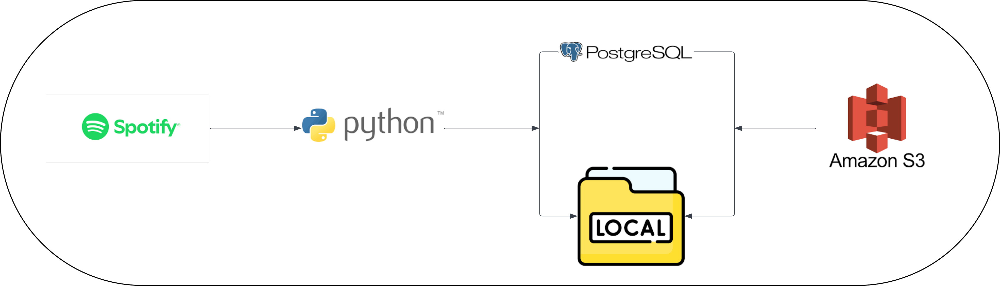

# Spotify-ETL-pipeline-and-s3
A complete ETL (Extract, Transform, Load) pipeline built with Python that connects to the Spotify Web API, processes and stores the data in a PostgreSQL database, and uploads data to AWS S3 for storage. It is a great project for learning real-world data engineering, API integration, and cloud storage with AWS.

---
## Project Architecture

---

## Features
- Spotify API integration
- PostgreSQL local database
- Data upload to AWS S3
- Python-based ETL pipeline

---

## 🚀 Tech Stack

- **Python 3**
- **Spotify Web API**
- **PostgreSQL**
- **AWS S3**
- **psycopg2** – PostgreSQL driver
- **boto3** – AWS SDK for Python
- **dotenv** – For secure configuration management

---

## 📊 Database Schema Overview

- user(id, name)
- playlist(id, name, user_id)
- artist(id, name)
- album(id, name)
- track(id, name, playlist_id, artist_id, album_id)

---


## Setup

### 1. Clone the repository

```bash
git clone https://github.com/Sauravn04/Spotify-ETL-pipeline-and-s3.git
cd Spotify-ETL-pipeline-and-s3
```
### 2. Create and activate a virtual environment

```bash
python -m venv .venv
source .venv/bin/activate      # On Windows use: .venv\Scripts\activate
```

## 3. Install dependencies

```bash
pip install -r requirements.txt
```
## 4. Create a .env file from template

Create a `.env` file using `.env.example`

